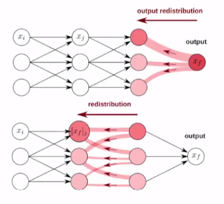

# SAI-board (Cyber Security AI Dashboard)
This repository is constructed for "Cyber Security AI Dashboard" and linked with streamlit.

**Demonstrating the power of Streamlit.** 

## 1. LRP

XAI can interpretate the black-box deep AI model which is constructed with many Linear, Convolution layers. 
Pytorch, which is the biggest AI opensource code library with tensorflow, constructed "Captum", XAI library, that can interprete deep AI model with Linear and Conv layer.
There are many XAI techniques, and this repository use LRP.

Let's see ML example first with **Linear Regression** and **Decision Tree**.
First with Linear Regression, we can get ***coefficient*** and ***intercept***.
You can get important x variable with **Coefficient Importance** like below image.
Also with Decision Tree, we can visualize how the tree was divided to leaf recursively.

  

### However, how we can get importance variable and visualize the NN model?

LRP is a word which is shorten version of "Layer-wise Relevance Propagation".
Traditionally, Neural Network used to be "black-box model" which is not interpretable. 
This means, when NN make a decision, we cannnot know **why NN make such decision**.
And go further, when NN make wrong decision, we cannot revise model because we donnot know **what makes wrong decision**

***[Reference URL-eng](https://towardsdatascience.com/indepth-layer-wise-relevance-propagation-340f95deb1ea)***

***[Regerence URL-korean](https://angeloyeo.github.io/2019/08/17/Layerwise_Relevance_Propagation.html)***

## 2. Streamlit Dashboard (data visualization)
